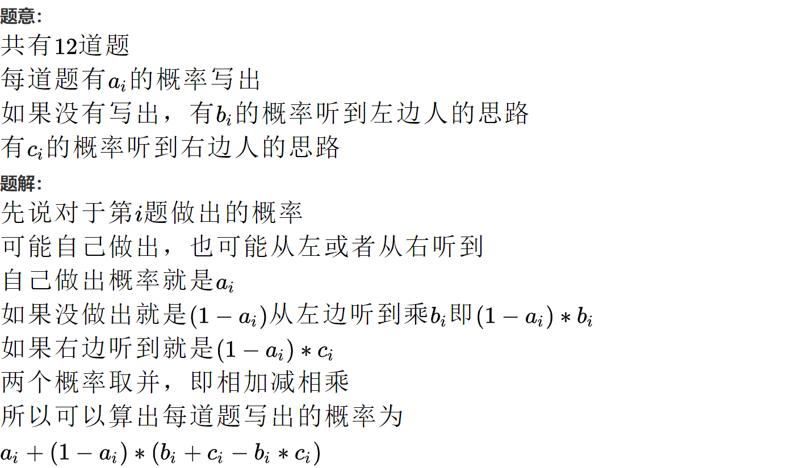

# 认真看题啊啊啊


# 不要想当然，图一时的快

## 后面学一下概率的问题：

[比赛 (nowcoder.com)](https://ac.nowcoder.com/acm/problem/14734)

[比赛题目题解_牛客竞赛OJ (nowcoder.com)](https://ac.nowcoder.com/acm/problem/blogs/14734)

(后面再来看看，也可以用枚举也能拿用概率dp来做)



(这里一边听左和一边听右的，概率后面好好看看，现在没懂)

（也可以倒推：先算全部听不出来（这个竟然跟顺序没有关系））


-----


（贪心，但一定要掌握这种贪心方法）

https://ac.nowcoder.com/acm/problem/16561

## 当提到【让什么的最*值尽可能大或者小】一般是二分或者贪心中的推公式


## [拼数](https://ac.nowcoder.com/acm/problem/16783)

将多个正整数拼接成一个最大的正数


(为了图方便还是直接比较拼接后的简单)

```java
/*
很容易想到按字典序从大到小排序
但是这样存在缺陷当"3"和"31"，那么按字典序可能拼为"313"
所以正确的比较方式为a+b>b+a
*/
```


## 贪心：[均等假设法：](https://cloud.tencent.com/developer/article/2083415)

同一个局面，如果这个贪心策略最后会产生两种不同的结果，那么不能用贪心


## 当`dp`属性是max值时，可以将除初始状态都赋值为最小值，这样可以避免一些特判

## 当出现出现负数，需要移动数组时：

[失衡天平](https://ac.nowcoder.com/acm/problem/19158)

比如`f[i][j]`：当j会出现负数时该怎么办：

​		这时只需将`f[i][j+k]`:**只动数组，其他循环该负数还是负数,其他都不动**

```c++
状态表示：
    f(i,j)
    集合：从前i个中选，左右天枰相差j的方案
    属性：max的重量
状态计算：
    不选：    f(i-1,j)
    若存在，放左天平：f(i-1,j-w[i])+w[i]
    若存在，放右天平：f(i-1,j+w[i])+w[i]
    
 //记住所有数组这个位置都+k，但是其他地方都不动
    for(int j=-maxc;j<=maxc;++j){   
            int t=f[i-1][j+sumw];
            if(f[i-1][j+sumw-w[i]]||j-w[i]==0){//要保证这个位置存在
                        //然后这里用了逻辑运算小小简化下
                t=max(t,f[i-1][j+sumw-w[i]]+w[i]);
            }
            if(f[i-1][j+sumw+w[i]]||j+w[i]==0){
                t=max(t,f[i-1][j+sumw+w[i]]+w[i]);
            }
//             cout<<"差值："<<j+sumw<<":"<<t<<endl;
            f[i][j+sumw]=t;
        }
```


## 判断奇偶（出现负数时）：最好只跟0比或者用`&`与运算

​	（-1%2=-1）

（负数的奇数%2=-1）

负数的奇数&1=1


## 如果有求最值的可以先想想二分答案

二分答案本质是一种逆向思维：（想不出来的时候：试一下从答案推回去是否可行）

(如果是符合条件的最小最大值都能试试)

- **情景**：如果**从答案逆向推回去比较简单，并且有明显的分界线**（比如：小于k时符合条件，大于等于k就不符合了），这时候一定要试试
- **答案范围**：注意边界问题后，你可以范围大，但是**一定不能小了**


## 最后所有的数都变为同一个数或者要在同一个时间内结束，然后你每次能用一个东西去减少差距：

让你求最值，试试**二分答案**。

但是**当存在相对速度时**一定要注意：就是如果你用这个东西的时候，他的速度就以这个为准时（原来那个速度就没了）,那么这时一定要用相对速度，不然有部分差距就会多减了

（例如：下面的[晾衣服](https://ac.nowcoder.com/acm/problem/235254)，自然烘干的速度是1，然后用烘干机的速度是k=>这时**烘干机能填补的速度应该是`k-1`**）

### [扑克牌 ](https://ac.nowcoder.com/acm/problem/19916)(二分答案)（再看看推理过程）：

题目：有n种牌，每种有`c[i]`张，然后有m张`joker`，`joker`能代替任何一张牌。你可以用每种牌各一张来组成一套牌，但是每套牌最多只有一张`joker`。比如，当n=3时，一共有4种合法的套牌：{1,2,3}, {J,2,3}, {1,J,3}, {1,2,J}。你的任务是组成尽量多的套牌。

-----

本质上：就是去补柱状图，将张数不能达到k套牌的，补到k。

​				每次只能有一张`joker`,所以最多只能补`min(k,m)`次

```c++
/*思维过程：
先是正常的推出答案：
    你看c数大得离谱，如果思路中要一个个慢慢减的大概率都不行
    想了挺多种可行的，但是复杂度都太高了，肯定过不了
逆向推回去：
    假设一下答案，好不好判断这个答案是否可行？
    是否能组成k套牌？
        先从简单的去推，先忽略掉m张joker这个条件，假设它有无限张
        最后每一种牌都用了k张，然后不够的使用joker去填补的
        （这里最好画个柱状图，值为k那边画一条线）：
            1. 会发现c[i]中大于等于k的都不用管
            2. 当sum(k-c[i])>k时不能组成k副牌：（这里要点思维）
                注意题目给的条件:一副牌中最多只有一张joker
                （也就是说你柱状图中用值小于k的去切，不能同时出现两个joker）
                填补的总和不能大于k：
                    如果你k套安排的特别好，每一个joker都出现了一次，最多最多就是k个了，如果还需要填补，那肯定会出现两个
*/

#include<bits/stdc++.h>
using namespace std;
typedef long long ll;
const int N=60;
int n;
int m,c[N];
bool check(int x){//判断能否组成x套牌
    ll sum=0;//差值的总和
    for(int i=0;i<n;++i){
        if(c[i]>=x) continue;//不用joker来补
        sum+=x-c[i];
        if(sum>x||sum>m) return 0;
        //一种是会同一套牌中会出现两个以上joker，另一种是joker不够了
    }
    return 1;
}
int main(){
    cin>>n>>m;
    for(int i=0;i<n;++i)
        cin>>c[i];
        
    //找最多的套牌：符合条件的最大值（右找模板）
    int l=0,r=1e9;//注意：大概的答案范围
        /*求最大值：
            c每一个都等于5e8，joker最多5e8张
            大概估计一下就行,如果k=1e9，sum(k-c[i])远远大于5e8
                    */
    while(l<r){
        int mid=(l+r+1)>>1;//上取整
        if(check(mid)) l=mid;//答案这个区间
        else           r=mid-1;//配等
    }
    cout<<l;
    
    return 0;
}
```

（跟题目比较无关的想法，但是感觉有用的）：像这种最后使用的个数一样的，每次只有补的那个能减少差距，其他没被补的差距都不变


### [晾衣服 (nowcoder.com)](https://ac.nowcoder.com/acm/problem/235254)（二分答案）

```c++
/*
逆向思维：从可能的答案求回去
    发现烘干时间有明显的分界线，一部分能烘干，零一部分不能
    求的符合条件的最小值，向左模板

(这题可以跟扑克牌那题整合一下，感觉是一种类型)
如何判断最小分钟x,是否符合条件？
    这里要注意一下：x之下是自然烘干就能完成，
                  但是x之上那些需要额外用烘干机去烘干，
                  烘干机能额外烘干的速度是相对于自然烘干的速度
    反正就是x次将衣服减k-1，能否将所有衣服都减到x一下
*/
#include<bits/stdc++.h>
using namespace std;
const int N=1e5+10;
int a[N],k,n;
bool check(int x){
    long long cnt=0;//记录需要减几次
    for(int i=0;i<n;++i){
        if(a[i]>x) cnt+=ceil(1.0*(a[i]-x)/k);//需要上取整
                            //小心类型转换
        if(cnt>x) return 0;
    }
    return 1;
}
int main(){
    cin>>n;
    int amax=0;//小优化：烘干所有衣服的上界
    for(int i=0;i<n;++i){
        cin>>a[i];
        amax=max(amax,a[i]);
    }
    cin>>k;
    --k;//哇靠巨坑，这里注意下，要相对速度
        // 水量每分钟会减小k单位,其中k-1是吹风机吹干的
    //特判
    if(k==0){
        cout<<amax;
        return 0;
    }
    int l=1,r=amax;
    while(l<r){
        int mid=l+r >>1;
        if(check(mid)) r=mid;
        else           l=mid+1;
    }
    cout<<l;
    
    return 0;
}
```


## 整型相乘，一定要变为`ll`

## （`java`) `int`变为`ll`，但是又通过取模变回来，一定要注意整型转化一定要最后算


## ==有多组数据，每组一定要注意初始化==

## 更具普适性的`bfs`模板(比赛直接用这个)
（搜索比赛时怕错，可以用迭代优化的办法：就是不标记搜过的了，而是看答案是否比之前小来入队）


[小红闯沼泽地 (nowcoder.com)](https://ac.nowcoder.com/acm/problem/262098)

```
这里举例一种错误的思路:
每步权值为1或者2，然后想用双端队列搜，就需要转化为权值为1或者0
诶，这时候我有发挥我的奇思妙想了
就是直接当作0或者1，"然后加个都会有的路径n+m-2"

但是这里就是错的，如果路径为这个，你需要保证只往右和下走，不能有回去的路
5 5
1 1 1 1 1
0 0 0 0 1
1 1 1 1 1
1 0 0 0 0
1 1 1 1 1

这里都会有的路径不是n+m-2
```

> 3.  **更具普适性的模板**
>
>    （本质就是`spfa`求最短路算法）(**发生更新的点，还需要再入队**)
>
>    - 场景：**尤其是那些权值不是1或者0时**，很不好保证二段性和单调性，就是有时候后面才走过的值反倒会更好
>
>    - 做法：**就是将那些发生更新的入队**，同时可以整个小优化：就是队列中不出现的重复的点（没有这个优化，也没事）
>
>    > 标记可以换成是否在队列中，如果在队列中就没必要再入队了
>    >   反正还在队列中用的值已经更新过了，后续会重复用一个值搜两遍
>
>    - 区别：不看是否已经搜过
>
>      （声明：这里标记搜过的，其实就是第一次搜的时候，这种就是要避免后面还会出现更小的）
>
>    ```c++
>    bool has[];//现在这个不是标记是否搜过，而是表示是否在队列中
>    T ans/dist[];//记录权值(一般需要初始较大化)
>                                              
>    初始化起点和其他点
>    while(!q.empty()){
>        <类型> t=q.front();
>        q.pop();//该元素弹出
>        has[这个点]=false;
>        for(所有可拓展的情况){
>            if(不合法){
>                continue;
>            }
>            if(拓展情况更好){//更新后的值<ans[][]
>    			更新一下值
>                 if(不在队列中){
>    				q.push(合法);//入队
>                     has[这个点]=true;
>            	}
>            }
>                                              
>        }
>    }
>    ```


### ==搜索一定要测试一下回型的样例==

### 注意起点就是答案的情况


## 因为数组越界的区间移动：

1. 像那些搜索算法，会自己动的：（全部都移动）

   - 起点那边和每个点都加一下

   - 判断边界也要加
2. 如果是那种有正负边界的：(只移动数组那边)
   - 只动所有的数组的下标
   - 其他循环判断都不动


##  不断查找字符串来替换

注意：`c++的s.find(要找的字符串【,int pos】)`和``java的s.indexOf(要找的字符串【,int pos】)``

1. **每次找完`pos`一定要`+1`**，不然会死循环

2. 两个字符传不一定相同：

   ```java
   				int k = t.indexOf(a[i]);
   				while (k != -1) {
   					String x = t.substring(0, k) + b[i] + t.substring(k + a[i].length());// 字串变换
   										//这里我真的服啦，a[i]和b[i]的大小不一定相同
   					k=t.indexOf(a[i], k+1);//这一步千万别忘了，一定要往下走
   					
   					代码在这写
   				}
   ```


## **有多组数据每次都不要忘记初始化**


## 双指针的边界

`for`循环中找下一个不同的，循环最优有`++i`，并且不一定能到`j`那边所以`i`应当要指向最后一个相等就是`i=j-1`

```c++
for(int i=start;i<n;++i) {
    /*中间一堆操作,可能中途退出*/
    int j=i+1;
    for(;j<n;++j) {
        if(w[j]!=w[i]) break; 
    }
    i=j-1;
}
```


## 整型有除法最好放最后

比如`2/n*x`：按照运算顺序，先算除法，算出个0出来，误差太大了


## 数组的复制：

(像什么移动插入交换，最好都复制一遍，复制数组不动，改变原数组就行)

**特别注意：**

> **如果是数组直接等于另一个数组时`数组a=数组b;`，要特别注意，因为这时会共用同一个地址了，很危险**
>
> 这时你在什么改变都是同一个数组，最后都会相同

`Arrays.copyOf`:这个会生成**副本**，这样可以尽可能的避免用同地址问题【上面等于没有问题，因为又生成一个新的地址，并没有指向同一块地址】

`System.arrayscopy`:是**直接将值复制过去**，如果这时还直接`数组=备份数组`这时就会有问题了

例：(呜呜，又写了个小bug)

```java
				for(int k=r+1;k<n;++k) {//枚举插入点
					System.arraycopy(q, 0, back[u], 0, n);
					。。。。。
                      //q=back[u];
                      /*这样是错的，
                      		k到下一次循环时，q数组已经指向了back[u]数组
                      		这时q数组原来的地址已经丢失了，q这时就是back[u]数组
                      		也就是说后面无论q都是等于back[u]的
                      */
					System.arraycopy(back[u], 0, q, 0, n);
				}
```

注意：**如果是值复制，那么后面还原时也要复制**

**方法**：

- `int b[]=Arrays.copyOfRange(a,l,r);`:截取数组,注意: 左闭右开:$[l,r)$

  `Arrays.copyOf(a,len)`

  > 这个是新生成一个数组，不是单纯的复制值
  >
  > 也就是说**会覆盖**，因此最好每次复制时直接`Arrays.copyOf(a,N)`，这样可以尽可能避免因为覆盖而缩小的问题

- `public static void arraycopy(Object src, int srcPos, Object dest, int destPos, int length)`

  > 第一个参数是要被复制的数组
  > 第二个参数是被复制的数字开始复制的下标
  > 第三个参数是目标数组，也就是要把数据放进来的数组
  > 第四个参数是从目标数据第几个下标开始放入数据
  > 第五个参数表示从被复制的数组中拿几个数值放到目标数组中
  >
  > [System.arraycopy的使用方法详解_arraycopy方法的作用-CSDN博客](https://blog.csdn.net/wenzhi20102321/article/details/78444158)


## 名词定义（比赛时，一般是不会给的）

- 子串（substring）:连续的字符

  > 例子:
  >
  > ab的子串：a、b、ab、/0(空串）共4个即（2+1+1）个，
  > abc的子串：a、 b、 c、 ab、 bc 、abc、/0共（3+2+1+1）个

- 子序列(subsequence)：**任意地选取**，即不用连续


[浅谈子串和子序列的相同点和不同点_子序列和子串的区别-CSDN博客](https://blog.csdn.net/qq_39463175/article/details/124393481)\


## 注意：排序函数一般是左闭右开

也就是说从1开始有n个:`sort(a+1,a+1+n)`


## 同名全局变量会被局部变量覆盖

```c++
全局int n;
主函数{
    int n;//这时候全局的那个被覆盖了
}
```


## 重要思想：==下标表示数轴，求各种对==


[AcWing 1236. 递增三元组（蓝桥杯辅导课） - AcWing](https://www.acwing.com/activity/content/code/content/7889297/)

给定三个整数数组

$A=[A_1,A_2,…A_N]$
$B=[B_1,B_2,…B_N]$
$C=[C_1,C_2,…C_N]$

请你统计有多少个三元组 $(i,j,k)$满足：
1. $1≤i,j,k≤N$
2. $A_i<B_j<C_k$

---


 **思路：**
 > **关键点**:从B数组这个中间数为媒介，对于$三元组_{B[i]}=A数组比B[i]小的 * C数组比B[i]大的$

 (树状数组那边求各种对一定要记住)
  ==**这些数都不大，用下标来表示数轴在合适不过了**==

  例如：数组$cnt[i]$表示当前位置上有几个数 

> 1. 求这个数组[1,i-1]的区间和，表示有多少个小于i的数
> 2. 求这个数组[i+1,n]的区间和，表示有多少个大于i的数

## [浅谈子串和子序列的相同点和不同点_子串 子序列-CSDN博客](https://blog.csdn.net/qq_39463175/article/details/124393481)

